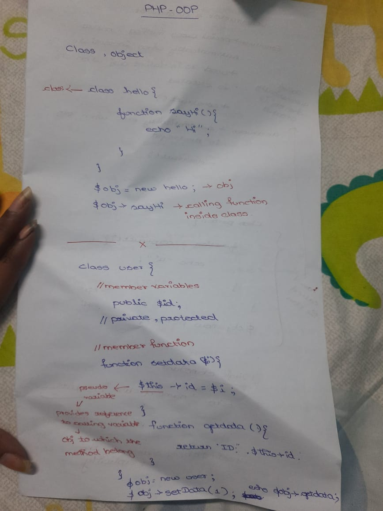
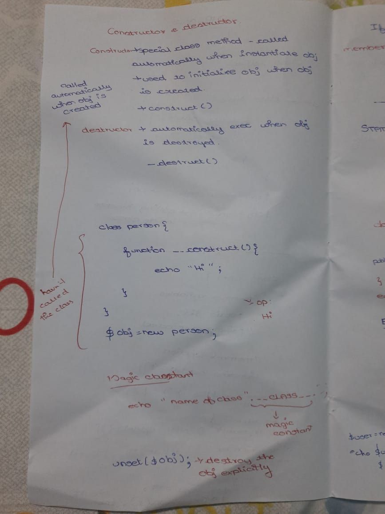

# oops in php
-object-oriented programming is about creating objects that contain both data and functions.

---
# class
-Let's assume we have a class named Fruit. A Fruit can have properties like name, color, weight, etc. We can define variables like $name, $color, and $weight to hold the values of these properties.
-A class is defined by using the class keyword, followed by the name of the class and a pair of curly braces ({})

# syntax
class Fruit {
  // code goes here...
}

# setting and getting method
class Fruit {
  // Properties
  public $name;
  public $color;

  // Methods
  function set_name($name) {
    $this->name = $name;
  }
  function get_name() {
    return $this->name;
  }
}

---
# objects
-Classes are nothing without objects! We can create multiple objects from a class. Each object has all the properties and methods defined in the class, but they will have different property values.

-Objects of a class are created using the new keyword.

-$apple = new Fruit();
-$banana = new Fruit();
# class&obg.php output 
<picture>

</picture>

# notes-obj&class
<picture>

</picture>

---
# constructor

-A constructor allows you to initialize an object's properties upon creation of the object.

-If you create a __construct() function, PHP will automatically call this function when you create an object from a class.

-special class method-called automatically when instantiated
# syntax 
function __construct($name) {
    $this->name = $name;
  }

# deconstructor

-A destructor is called when the object is destructed or the script is stopped or exited.

-If you create a __destruct() function, PHP will automatically call this function at the end of the script.

# notes-constructor deconstructor
<picture>

</picture>

---
# access modifiers
>There are three access modifiers:

-public - the property or method can be accessed from everywhere. This is default
-protected - the property or method can be accessed within the class and by classes derived from that class
-private - the property or method can ONLY be accessed within the class

---
# inheritance
-Inheritance in OOP = When a class derives from another class.

-The child class will inherit all the public and protected properties and methods from the parent class. In addition, it can have its own properties and methods.

-An inherited class is defined by using the extends keyword.

# output 
<picture>

</picture>

---
# abstract 
-Abstract classes and methods are when the parent class has a named method, but need its child class(es) to fill out the tasks.

-An abstract class is a class that contains at least one abstract method. An abstract method is a method that is declared, but not implemented in the code.

---
# interface
-Interfaces allow you to specify what methods a class should implement.

-Interfaces make it easy to use a variety of different classes in the same way. When one or more classes use the same interface, it is referred to as "polymorphism".